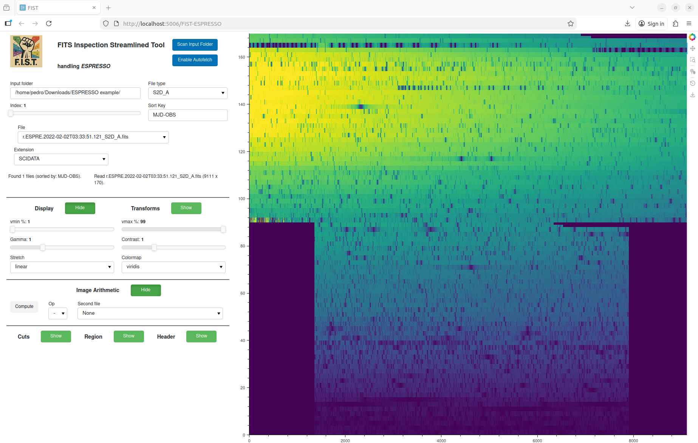

# `fist` - FITS Inspection Streamlined Tool


`fist` is a lightweight, FITS visualization tool built with **Python**, **Panel**, and **Bokeh**. 
It is designed for rapid inspection, manipulation, and simple analysis of astronomical FITS images, with built-in support for instrument-specific configurations (such as **ESPRESSO**  or **KPF**), multi-extension FITS files, interactive region and cuts analysis, and automatic folder monitoring, among others. 

<p align="center">
  
</p>

It can be used as a starting point to develop interactive or automated tools, for use in advanced analysis or quicklooks at the telescope. 

`fist` runs as a small local web application and requires no installation beyond Python and your standard browser.

---

## ✨ Features

### 🔭 FITS Image Viewer
- Fast visualization of image slices from multi-extension FITS files
- Automatic sourcelet/apertures/fibers detection (3-D cubes)
- Percentile-based scaling, gamma, contrast, colormap control
- Image transforms: rotation, flips, negative and arithmetic operations

### ✂️ Interactive Cuts and 🟦 Region Analysis
- Display of diagonal cut profiles and definition of analysis regions
- Interactive drawing with real-time updates and simple live statistics

### 📜 Header Viewer
- Automatic detection and display any FITS extension header
- Fixed-width formatting for readability; search bar for fast filtering

### 🔁 Autofetch Mode & Scripting
- Monitoring for new FITS files
- Automatic operation / manipulation of files for display and analysis
- Easy implementation of real-time pipelines and quick-look operations

### 🧩 Instrument Configuration
- Load per-instrument configs and rules (patterns, extensions, sourcelet 
names, defaults)
- reads automatically multi-cube sourcelet and assigns predefined names 
(e.g. KPF)
- predefined configuration for spectrographs ESPRESSO, KPF, HARPS, HARPS-N, 
and CORALIE
- Enables future support for new instruments, pipelines or tailored observing 
modes of existing instruments

---

## 📦 Installation

### 1. Install Python ≥ 3.10

### 2. Create and activate a virtual environment (recommended)

For instance, using `conda`
```
conda create -n fist python=3.10
conda activate fist
```
### 3. Download and install package locally

Clone the repository and move to its local folder

```
git clone https://github.com/pedrorfigueira/fist.git
cd fist
```

and run

```
pip install .
```
To install in editable / developer mode use the flag `-e`; this enables live code editing without having to reinstall.

## 🔧 Dependencies

`fist` depends on the following Python packages:

- Python ≥ 3.10
- [NumPy](https://numpy.org/)
- [Astropy](https://www.astropy.org/)
- [Bokeh](https://bokeh.org/)
- [Panel](https://panel.holoviz.org/)
- [Matplotlib](https://matplotlib.org/)

All dependencies are declared in `pyproject.toml` and are installed automatically when running `pip install .`.

## 🧪 Testing

### Test 1: Verify Installation

After installing the package, run:

```
python -c "import fist; print('fist package imported successfully')"
```

Expected result:

```
fist package imported successfully
```

If this fails, check that your environment is activated and dependencies are installed.

### Test 2: Launch the Viewer

Run the viewer with the default instrument and a known directory using python

```
fits --instrument ESPRESSO --folder example
```

Expected behavior:

- A browser window should open automatically.
- The left control panel should be visible. It includes file selection tools and colapsed sections for Display, Transforms, Image Arithmetics, Cuts, Region, and Header. 
- The right side should display the ESPRESSO test image.
- No traceback/errors should appear in the terminal.

Both a `CCF_A` and a `guiding` image examples are provided with the package for testing.

## 🖥️ Running and using `fist`

After installation, the software can be launched from the command line

```
fist --instrument INS --folder /path/to/data
```

Where:

 - `--instrument` specifies the instrument configuration to load
 - `--folder` specifies the directory containing FITS files

If `--folder` is omitted, the package uses the instrument’s default starting directory.

When launched, the interface opens in your browser and displays a series of controls (left) and FITS image pane (right). 

The file browser is always expanded and allows direct scan / autofetch of files plus individual selection.

Below a series of collapsible section allows to control the display and image transformation, and do arithmetics between two images.

The selected image (or result of image operation) can be visualized and interacted upon (via cuts, regions, statistics) and the image header can be inspected.

## 📚 Folder Structure

```
fist/
│
├── paper.md
├── paper.bib
├── pyproject.toml
├── README.md
├── LICENSE
├── .gitignore
│
└── fist/
    ├── __init__.py
    ├── app.py
    ├── fist.py
    ├── core/
    │   ├── __init__.py
    │   ├── state.py
    │   ├── instruments.py
    │   ├── sessionmng.py
    │   ├── loader.py
    │   ├── transforms.py
    │   ├── scaling.py
    │   ├── display.py
    │   └── layout.py
    ├── tools/
    │   ├── __init__.py
    │   ├── analysis.py
    │   ├── arithmetic.py
    │   └── header.py
    ├── static/
    │   ├── FISTlogo.png
    │   ├── ESPRESSO_guiding.fits
    │   └── ESPRESSO_CCF_A.fits
    └── docs/
        └── FISTsreenshot.png

```

## 📄 License

This project is distributed under the MIT License.

## 🤝 Contributing

Contributions are welcome!
Please open issues or pull requests for:

- new instruments
- UI improvements
- bug fixes
- performance optimizations

## 🙌 Acknowledgements

Pedro Figueira acknowledges financial support from the Severo Ochoa grant CEX2021-001131-S funded by MCIN/AEI/10.13039/501100011033. Pedro Figueira is also funded by the European Union (ERC, THIRSTEE, 101164189). Views and opinions expressed are however those of the author(s) only and do not necessarily reflect those of the European Union or the European Research Council. Neither the European Union nor the granting authority can be held responsible for them.

This project depends on several open-source scientific and visualization packages. We gratefully acknowledge their authors and contributors:

[NumPy](https://numpy.org/) and [Scipy](https://scipy.org/) provide the core array infrastructure and numerical utilities used in backend processing. [Astropy](https://www.astropy.org/) provides tools for FITS and for reading, parsing, and handling astronomical data formats. [Matplotlib](https://matplotlib.org/) is use for plotting. 

[Bokeh](https://bokeh.org/) enables interactive plotting and image rendering in the browser while [Panel](https://panel.holoviz.org/) enables the UI layout, reactive widgets, and server backend that make this application possible as a web interface.

We extend sincere thanks to all of these communities for developing and maintaining the scientific Python ecosystem.


